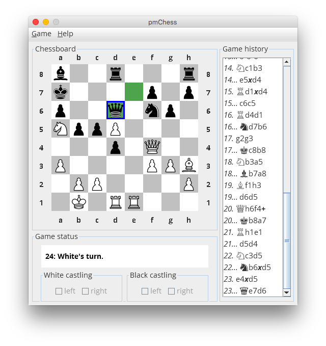

**Software:** _pmChess_ (poor man's chess)

**Public _Git_ repository:** https://github.com/christoff-buerger/pmChess

**Author:** Christoff Bürger (`christoff.buerger@gmail.com`)

# Introduction

_pmChess_ is a poor man's chess. It started as student project to learn basic artificial intelligence game-playing concepts. To that end, _pmChess_ is nicely modularized, with clean interfaces for user interaction, chessboard representation, movement analysis and search strategy. It uses a common min-max search with alpha-beta pruning in combination with an intuitive scoring-heuristic for figure-constellations. The simple setup eases understanding and the integration of own scoring-heuristics. All in all, _pmChess_ provides a good starting point for wanna-be chess developers.

Of course, _pmChess_ cannot compete with professional chess programs; after all, it's just a poor man's chess. But it is a complete chess program incorporating all rules wrapped in a convenient user interface.

# Rule limitations

_pmChess_ implements the official rules of [_FIDE_](https://www.fide.com/) (_Fédération Internationale des Échecs_) except for the following draw rules:
 1. **3- and 5-repetition rules:** The same position occurs 3/5 times (3 times: claimable draw; 5 times: automatic draw).
 2. **50- and 75-moves rules:** The last 50/75 successive moves made by both players contain no capture or pawn move (50-moves: claimable draw; 75-moves: automatic draw).
 3. **Insufficient material:** Neither player has a theoretical possibility to checkmate the opponent.

# Graphical user interface

Figures are moved on the _Chessboard_ pane using the keyboard. A blue rectangle marks the cursor position; a red rectangle marks the currently selected figure to move. The arrow keys are used to move the cursor. Space is used to select a figure or to move the currently selected figure to the cursor's position if the respective move is allowed. The last move is highlighted by drawing the involved chessboard tiles green.

The _Game status_ tab summarizes the current player (background color of the status message), turn number, game status (checkmate, check, draw, stalemate, capitulation or normal move) and castling possibilities considering previous moves (checkboxes for left and right castling of each player). The castling summary shows only whether left or right castling are impossible due to previous king or rook movements; if checked, previous movements are not prohibiting castling. The promotion-list is used to select the figure to promote to in case of pawn promotion. A bulb icon at the end of the status message signals that the computer is busy deciding its move.

The _Game history_ pane to the right can be used to undo moves. It is written according to the algebraic notation specified by FIDE (cf. the [_FIDE Laws of Chess taking effect from 1 January 2018_](https://handbook.fide.com/chapter/E012018), _Appendix C. Algebraic notation_). To reset the game to a previous position, select a move using the up- and down-keys and press space. The game will be reset to the state resulting after executing the selected move.

The tab-key is used to switch between _Chessboard_, _Game status_ and its promotion-list and _Game history_.

# Releases

Official releases of _pmChess_ are available in version-numbered subdirectories of `releases`. Platform independent distributions are provided in respective `portable-jar` subdirectories; they require an installed runtime environment of the _Java Platform, Standard Edition_. Alternatively, native, self-contained distributions for _macOS_ and _Microsoft Windows_ are provided in `macOS` and `Windows` subdirectories.

# License

This program and the accompanying materials are made available under the terms of the MIT license (X11 license) which accompanies this distribution (cf. `license.txt`).

# Comments

For any questions or comments don't hesitate to write me an e-mail (`christoff.buerger@gmail.com`). I appreciate any feedback.
